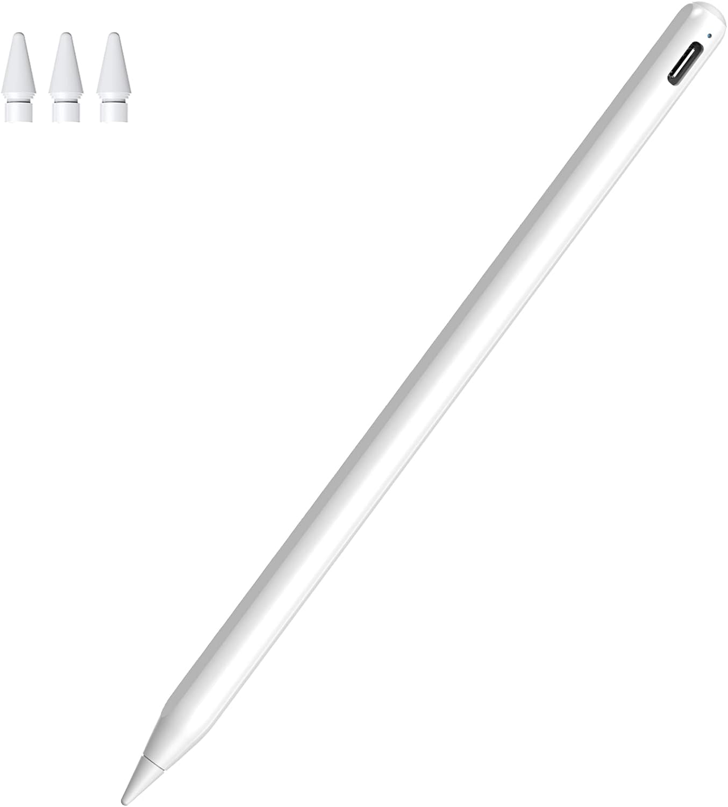
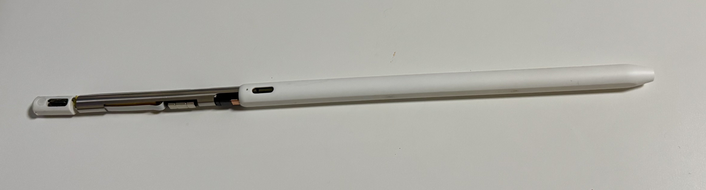
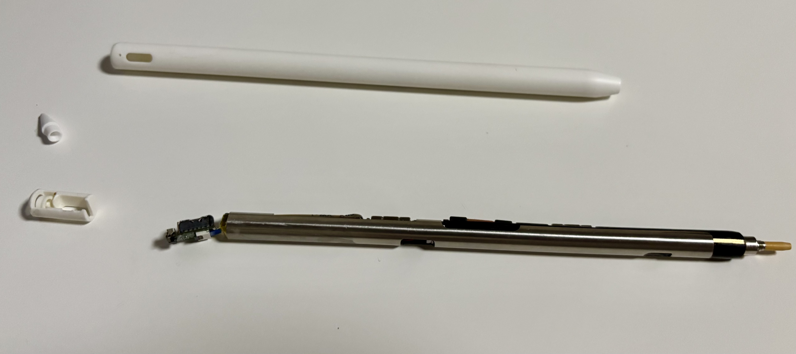
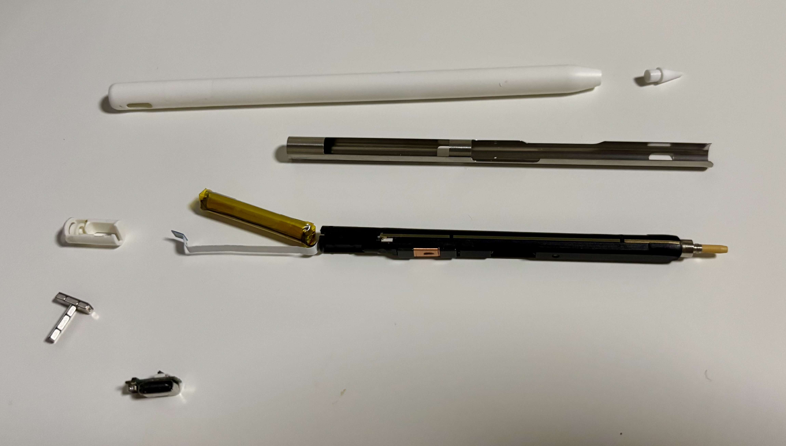
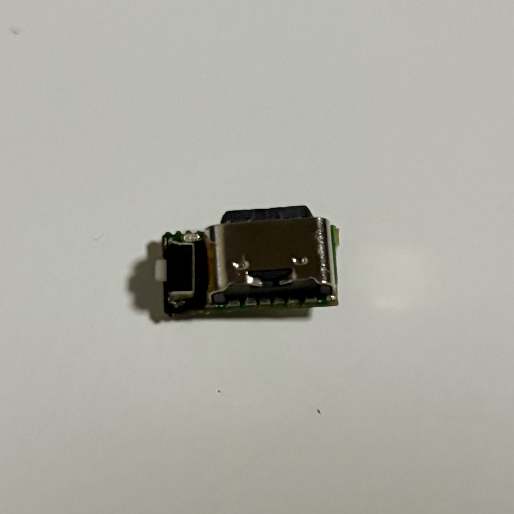
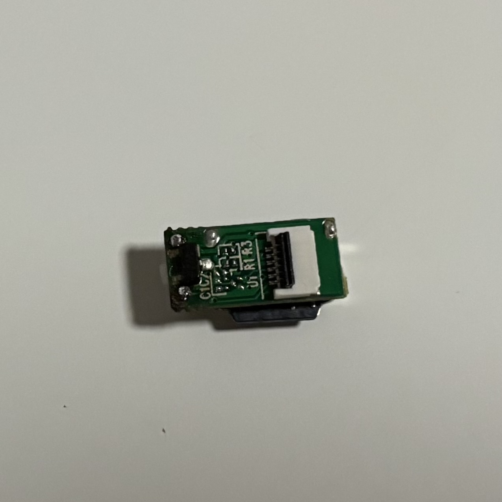

# 要約
**この記事は個人の分解・修理を勧めるものではありません。また、この記事を参考にして問題が発生しても一切の責任を負いません。**

- Amazonで販売されているApple Pencilの格安代用品 B-RB01 を使用していたが、落としたときにボタンが故障した。
- 似たボタンを購入し、交換したら治った。

# 製品紹介・故障について

お絵描きをせずメモ書きしかしない私にとって、純正のApple Pencilは非常に高価なので、[廉価な代用品](https://www.amazon.co.jp/dp/B0BZCRHVWC
) (アフィリエイトなし) をAmazonで購入して使用していた。

筆圧感知機能がない以外はApple Pencilと大きな差はなく、メモ書きには特に問題なく使用していた。
しかし、どこかで地面に落としたタイミングでノック部分のクリック感がなくなり、次第にペアリングが切れるようになってしまった。

# 分解・修理

ペン先を外し、ペン先側を押し込むと白い樹脂のケースと中の部品を分離できる。

注: Type-C部分は引っ張らないほうがいい。フラットケーブルが抜けてしまう。

ちなみに今回の修理では白い樹脂ケースを完全に外す必要はなかった。

Type-C部分の樹脂ケースをはずす。
Type-C端子を綿棒か何かで押すと白い樹脂部分と分離できる。

さらにフラットケーブルを爪を上げて外せばType-Cコネクタとスイッチを乗せた基板を取り外せる。

拡大するとこちら。

オモテ

ウラ

今回はこの基板に実装されていたスイッチが壊れてしまって、ずっと導通してしまっていた。

寸法を測って色々調べた結果、PanasonicのEVP-AKE31Aというスイッチがよさそうだったので約100円で購入した。 (Panasonicがこんな部品を販売しているのに驚き)

購入先: https://www.mouser.jp/ProductDetail/667-EVP-AKE31A

スイッチは2点ではんだ付けされているだけだったので、はんだ吸い取り線で元のスイッチを外し、上記のスイッチと交換する。
(交換前の写真を撮り忘れていたので、上に貼った画像はすでに交換済み)

あとは分解時の逆の手順で、Type-C基板をフラットケーブルで接続し、Type-C部分の樹脂ケースをはめ、ペン全体の樹脂ケースをはめ、ペン先を付けなおせば完成。

# おわりに
分解方法を手探りで試したり、ちょうどいいスイッチを探すのに手間取ってしまったが、わかってしまえば簡単な作業だった。
そもそもこのペン本体が3000円しないので、買いなおしたほうが賢明である。 (たぶん5時間ぐらいは費やしたと思う。)