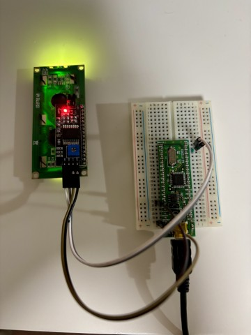
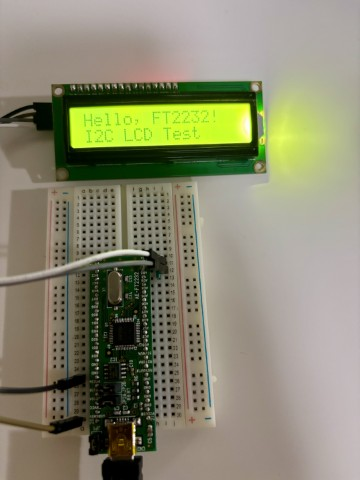

## はじめに

[アリエク](https://ja.aliexpress.com/item/1005006100081942.html)で買ったI2Cモジュール付きLCDディスプレイの動作テストに思ったよりてこずったので、記録する。

## 使用した部品・ツール

### ハードウェア
- **LCDディスプレイ**: 品番不明のI2Cモジュール付き1602 LCD（HD44780ベース）
- **FT2232Dモジュール**: [秋月電子のFT2232Dモジュール](https://akizukidenshi.com/catalog/g/g116897/)
- **その他**: ジャンパーワイヤー、ブレッドボード

### ソフトウェア
- **Python**: 3.10
- **pyftdi**: 0.56.0
- **OS**: Windows + WSL2 + usbipd

## 接続方法

### 配線図


### ピン接続
| FT2232D | LCD I2Cモジュール | 機能 |
|---------|------------------|------|
| ADBUS0 | SCL | I2C クロック |
| ADBUS1 + ADBUS2 | SDA | I2C データ（**重要**: 両方のピンを接続） |
| USBCN5V | VCC | 電源 |
| GND | GND | グランド |

**⚠️ 重要**: FT2232DでI2C通信を行う場合、ADBUS1とADBUS2の両方をSDAに接続する必要がある。

## 環境構築

### pyftdiのインストール
```bash
pip install pyftdi
```

## 実装

### I2Cデバイススキャナー
まずはI2Cモジュールのアドレスを調べるためのスキャナーScript（i2c_scanner.py）を作成。

<details>
<summary>i2c_scanner.py（クリックして展開）</summary>

```python
#!/usr/bin/env python3
"""
PyFTDI I2C Scanner
FT232H/FT2232H デバイスを使用してI2Cバス上のデバイスをスキャンします
"""
from pyftdi.ftdi import Ftdi
from pyftdi.i2c import I2cController


def scan_i2c_devices():
    """I2Cバス上のデバイスをスキャンしてアドレス一覧を表示"""

    # 使用可能なFTDIデバイスを表示
    print("Available FTDI devices:")
    devices = Ftdi.list_devices()
    if not devices:
        print("No FTDI devices found!")
        return

    for device in devices:
        device_desc, interface = device
        print(f"  {device_desc} - Interface {interface}")

    # 最初のデバイスを使用（複数ある場合は手動で選択可能）
    device_desc = devices[0][0]
    print(f"\nUsing device: {device_desc}")

    # I2Cコントローラーを初期化
    i2c = I2cController()
    # 3相クロックを無効化（FT2232HでのI2C使用時に必要）
    i2c._disable_3phase_clock = True

    # I2Cバスを設定（FTDIデバイスのURL文字列を作成）
    device_url = (
        f"ftdi://0x{device_desc.vid:03x}:0x{device_desc.pid:04x}"
        f":{device_desc.bus}:{device_desc.address}/1"
    )
    print(f"Configuring I2C controller with URL: {device_url}")

    try:
        i2c.configure(device_url)

        print("\nPriming I2C bus (performing a dummy read)...")
        try:
            # 本番スキャン前に一度「捨て読み」を行い、バスの状態を安定させる
            # この読み込みは失敗することが期待される
            # アドレスはスキャン範囲外の有効なものなら何でも良い
            i2c.get_port(0x00).read(1)
        except Exception:
            # エラーは想定内なので無視する
            pass

        print("\nScanning I2C bus...")
        print("     0  1  2  3  4  5  6  7  8  9  a  b  c  d  e  f")

        found_devices = []

        for addr in range(0x00, 0x78):
            # 0x08-0x77 の範囲をスキャン（I2Cの有効アドレス範囲）
            if addr < 0x08:
                device_marker = "--"
            else:
                try:
                    # 1バイト読み取りを試行してデバイスの存在を確認
                    port = i2c.get_port(addr)
                    port.read(1)
                    found_devices.append(addr)
                    device_marker = f"{addr:02x}"
                except Exception:
                    device_marker = "--"

            # 16進数表示のフォーマット
            if addr % 16 == 0:
                print(f"{addr:02x}: ", end="")

            print(f"{device_marker} ", end="")

            if (addr + 1) % 16 == 0:
                print()

        print("\n")

        # 見つかったデバイスを報告
        if found_devices:
            print(f"Found {len(found_devices)} I2C device(s):")
            for addr in found_devices:
                print(f"  0x{addr:02X} ({addr})")
        else:
            print("No I2C devices found.")

    except Exception as e:
        print(f"Error during I2C scan: {e}")

    finally:
        # I2Cコントローラーを閉じる
        i2c.terminate()


if __name__ == "__main__":
    scan_i2c_devices()
```
</details>

**実行結果:**
```
$ python3 i2c_scanner.py 
Available FTDI devices:
  UsbDeviceDescriptor(vid=1027, pid=24592, bus=1, address=2, sn=None, index=None, description='Dual RS232') - Interface 2

Using device: UsbDeviceDescriptor(vid=1027, pid=24592, bus=1, address=2, sn=None, index=None, description='Dual RS232')
Configuring I2C controller with URL: ftdi://0x403:0x6010:1:2/1

Priming I2C bus (performing a dummy read)...

Scanning I2C bus...
     0  1  2  3  4  5  6  7  8  9  a  b  c  d  e  f
00: -- -- -- -- -- -- -- -- -- -- -- -- -- -- -- -- 
10: -- -- -- -- -- -- -- -- -- -- -- -- -- -- -- -- 
20: -- -- -- -- -- -- -- 27 -- -- -- -- -- -- -- -- 
30: -- -- -- -- -- -- -- -- -- -- -- -- -- -- -- -- 
40: -- -- -- -- -- -- -- -- -- -- -- -- -- -- -- -- 
50: -- -- -- -- -- -- -- -- -- -- -- -- -- -- -- -- 
60: -- -- -- -- -- -- -- -- -- -- -- -- -- -- -- -- 
70: -- -- -- -- -- -- -- -- 

Found 1 I2C device(s):
  0x27 (39)
```

今回使用したLCDモジュールのI2Cアドレスは **0x27** でした。

### I2Cモジュールのピンアサイン
使用したI2Cモジュール（PCF8574ベース）のピン配置：

| PCF8574ピン | HD44780 LCDピン | 機能 | 
|-----------------|----------------|------|
| P0 | RS | レジスタセレクト |
| P1 | RW | リード/ライト |
| P2 | E | イネーブル |
| P3 | A (Backlight) | バックライト |
| P4 | D4 | データビット4 |
| P5 | D5 | データビット5 |
| P6 | D6 | データビット6 |
| P7 | D7 | データビット7 |

### LCDディスプレイ制御クラス
興が乗って日本語表示も実装しました。


<details>
<summary>i2c_scanner.py（クリックして展開）</summary>

```python
#!/usr/bin/env python3
"""
LCD I2C Control Module
PCF8574ベースのI2C LCD制御クラス
"""
import time
from pyftdi.i2c import I2cPort

# PCF8574 LCD I2C バックパックのピン配置定数
# PCF8574 Pin -> LCD Pin (HD44780) -> Function
RS_PIN = 0  # P0 -> RS (Pin 4) -> Register Select
RW_PIN = 1  # P1 -> RW (Pin 5) -> Read/Write
E_PIN = 2  # P2 -> E (Pin 6) -> Enable
BL_PIN = 3  # P3 -> Backlight Control (via transistor)
D4_PIN = 4  # P4 -> D4 (Pin 11) -> Data 4
D5_PIN = 5  # P5 -> D5 (Pin 12) -> Data 5
D6_PIN = 6  # P6 -> D6 (Pin 13) -> Data 6
D7_PIN = 7  # P7 -> D7 (Pin 14) -> Data 7

# ビットマスク定数
RS_MASK = 1 << RS_PIN
RW_MASK = 1 << RW_PIN
E_MASK = 1 << E_PIN
BL_MASK = 1 << BL_PIN
D4_MASK = 1 << D4_PIN
D5_MASK = 1 << D5_PIN
D6_MASK = 1 << D6_PIN
D7_MASK = 1 << D7_PIN

# HD44780 日本語文字マッピング（カタカナ）
# HD44780のA00 ROM（日本語版）のカタカナ文字コード表
KATAKANA_MAP = {
    "ア": 0xB1,
    "イ": 0xB2,
    "ウ": 0xB3,
    "エ": 0xB4,
    "オ": 0xB5,
    "カ": 0xB6,
    "キ": 0xB7,
    "ク": 0xB8,
    "ケ": 0xB9,
    "コ": 0xBA,
    "サ": 0xBB,
    "シ": 0xBC,
    "ス": 0xBD,
    "セ": 0xBE,
    "ソ": 0xBF,
    "タ": 0xC0,
    "チ": 0xC1,
    "ツ": 0xC2,
    "テ": 0xC3,
    "ト": 0xC4,
    "ナ": 0xC5,
    "ニ": 0xC6,
    "ヌ": 0xC7,
    "ネ": 0xC8,
    "ノ": 0xC9,
    "ハ": 0xCA,
    "ヒ": 0xCB,
    "フ": 0xCC,
    "ヘ": 0xCD,
    "ホ": 0xCE,
    "マ": 0xCF,
    "ミ": 0xD0,
    "ム": 0xD1,
    "メ": 0xD2,
    "モ": 0xD3,
    "ヤ": 0xD4,
    "ユ": 0xD5,
    "ヨ": 0xD6,
    "ラ": 0xD7,
    "リ": 0xD8,
    "ル": 0xD9,
    "レ": 0xDA,
    "ロ": 0xDB,
    "ワ": 0xDC,
    "ヲ": 0xA6,
    "ン": 0xDD,
    "ァ": 0xA7,
    "ィ": 0xA8,
    "ゥ": 0xA9,
    "ェ": 0xAA,
    "ォ": 0xAB,
    "ッ": 0xAF,
    "ャ": 0xD5,
    "ュ": 0xD7,
    "ョ": 0xB0,
    "。": 0xA1,
    "「": 0xA2,
    "」": 0xA3,
    "、": 0xA4,
    "・": 0xA5,
    "ー": 0xB0,
    "゛": 0xDE,
    "゜": 0xDF,
}

# ひらがなをカタカナに変換するマッピング
HIRAGANA_TO_KATAKANA = {
    "あ": "ア",
    "い": "イ",
    "う": "ウ",
    "え": "エ",
    "お": "オ",
    "か": "カ",
    "き": "キ",
    "く": "ク",
    "け": "ケ",
    "こ": "コ",
    "さ": "サ",
    "し": "シ",
    "す": "ス",
    "せ": "セ",
    "そ": "ソ",
    "た": "タ",
    "ち": "チ",
    "つ": "ツ",
    "て": "テ",
    "と": "ト",
    "な": "ナ",
    "に": "ニ",
    "ぬ": "ヌ",
    "ね": "ネ",
    "の": "ノ",
    "は": "ハ",
    "ひ": "ヒ",
    "ふ": "フ",
    "へ": "ヘ",
    "ほ": "ホ",
    "ま": "マ",
    "み": "ミ",
    "む": "ム",
    "め": "メ",
    "も": "モ",
    "や": "ヤ",
    "ゆ": "ユ",
    "よ": "ヨ",
    "ら": "ラ",
    "り": "リ",
    "る": "ル",
    "れ": "レ",
    "ろ": "ロ",
    "わ": "ワ",
    "を": "ヲ",
    "ん": "ン",
    "ぁ": "ァ",
    "ぃ": "ィ",
    "ぅ": "ゥ",
    "ぇ": "ェ",
    "ぉ": "ォ",
    "っ": "ッ",
    "ゃ": "ャ",
    "ゅ": "ュ",
    "ょ": "ョ",
}

# 濁点・半濁点文字を基本文字+濁点記号に分解するマッピング
DAKUTEN_DECOMPOSE = {
    # 濁点文字
    "ガ": "カ゛",
    "ギ": "キ゛",
    "グ": "ク゛",
    "ゲ": "ケ゛",
    "ゴ": "コ゛",
    "ザ": "サ゛",
    "ジ": "シ゛",
    "ズ": "ス゛",
    "ゼ": "セ゛",
    "ゾ": "ソ゛",
    "ダ": "タ゛",
    "ヂ": "チ゛",
    "ヅ": "ツ゛",
    "デ": "テ゛",
    "ド": "ト゛",
    "バ": "ハ゛",
    "ビ": "ヒ゛",
    "ブ": "フ゛",
    "ベ": "ヘ゛",
    "ボ": "ホ゛",
    "ヴ": "ウ゛",
    # 半濁点文字
    "パ": "ハ゜",
    "ピ": "ヒ゜",
    "プ": "フ゜",
    "ペ": "ヘ゜",
    "ポ": "ホ゜",
    # ひらがな濁点
    "が": "か゛",
    "ぎ": "き゛",
    "ぐ": "く゛",
    "げ": "け゛",
    "ご": "こ゛",
    "ざ": "さ゛",
    "じ": "し゛",
    "ず": "す゛",
    "ぜ": "せ゛",
    "ぞ": "そ゛",
    "だ": "た゛",
    "ぢ": "ち゛",
    "づ": "つ゛",
    "で": "て゛",
    "ど": "と゛",
    "ば": "は゛",
    "び": "ひ゛",
    "ぶ": "ふ゛",
    "べ": "へ゛",
    "ぼ": "ほ゛",
    # ひらがな半濁点
    "ぱ": "は゜",
    "ぴ": "ひ゜",
    "ぷ": "ふ゜",
    "ぺ": "へ゜",
    "ぽ": "ほ゜",
}


def decompose_dakuten_text(text):
    """濁点・半濁点文字を基本文字+濁点記号に分解"""
    result = ""
    for char in text:
        if char in DAKUTEN_DECOMPOSE:
            result += DAKUTEN_DECOMPOSE[char]
        else:
            result += char
    return result


class LCDI2C:
    """PCF8574ベースのI2C LCD制御クラス"""

    def __init__(self, i2c_port: I2cPort, backlight=True):
        self.port = i2c_port
        self.backlight_state = backlight

    def _write_pcf8574(self, data):
        """PCF8574に8ビットデータを書き込み"""
        # バックライト制御ビットを追加
        if self.backlight_state:
            data |= BL_MASK
        self.port.write([data])

    def _write_4bits(self, data, rs=False):
        """4ビットデータをLCDに送信（Enable信号付き）"""
        # データビット（上位4ビット）を準備
        output = (data & 0xF0) | (RS_MASK if rs else 0)

        # Enable High でデータ送信
        self._write_pcf8574(output | E_MASK)
        time.sleep(0.001)  # 1ms wait

        # Enable Low でデータ確定
        self._write_pcf8574(output & ~E_MASK)
        time.sleep(0.001)  # 1ms wait

    def _write_byte(self, data, rs=False):
        """8ビットデータを4ビットモードで送信"""
        # 上位4ビットを送信
        self._write_4bits(data & 0xF0, rs)
        # 下位4ビットを送信（4ビット左シフト）
        self._write_4bits((data << 4) & 0xF0, rs)

    def send_command(self, cmd):
        """LCDにコマンドを送信（RS=0）"""
        self._write_byte(cmd, rs=False)
        time.sleep(0.002)  # 2ms wait for command execution

    def send_data(self, data):
        """LCDにデータを送信（RS=1）"""
        self._write_byte(data, rs=True)
        time.sleep(0.001)  # 1ms wait for data write

    def set_backlight(self, state):
        """バックライトの状態を設定"""
        self.backlight_state = state
        # 現在の状態でダミー書き込みしてバックライトを更新
        self._write_pcf8574(0)

    def init_lcd(self):
        """LCD初期化シーケンス（4ビットモード）"""
        # 初期化待機
        time.sleep(0.05)  # 50ms

        # 8ビットモードで初期化開始
        self._write_4bits(0x30)
        time.sleep(0.005)  # 5ms

        self._write_4bits(0x30)
        time.sleep(0.001)  # 1ms

        self._write_4bits(0x30)
        time.sleep(0.001)  # 1ms

        # 4ビットモードに設定
        self._write_4bits(0x20)
        time.sleep(0.001)  # 1ms

        # Function Set: 4-bit, 2 lines, 5x8 dots
        self.send_command(0x28)

        # Display Off
        self.send_command(0x08)

        # Clear Display
        self.send_command(0x01)
        time.sleep(0.002)  # Clear command needs extra time

        # Entry Mode Set: increment cursor, no shift
        self.send_command(0x06)

        # Display On: display on, cursor off, blink off
        self.send_command(0x0C)

    def clear(self):
        """画面をクリア"""
        self.send_command(0x01)
        time.sleep(0.002)  # Clear command needs extra time

    def set_cursor(self, col, row):
        """カーソル位置を設定"""
        # HD44780のDDRAMアドレス計算
        row_offsets = [0x00, 0x40, 0x14, 0x54]  # 1,2,3,4行目の開始アドレス
        if row < len(row_offsets):
            addr = 0x80 + row_offsets[row] + col
            self.send_command(addr)

    def write_char(self, char):
        """1文字をLCDに表示"""
        self.send_data(ord(char))

    def _convert_japanese_char(self, char):
        """日本語文字をHD44780のコードに変換"""
        # ひらがなの場合はカタカナに変換
        if char in HIRAGANA_TO_KATAKANA:
            char = HIRAGANA_TO_KATAKANA[char]

        # カタカナまたは日本語記号の場合はマッピング
        if char in KATAKANA_MAP:
            return KATAKANA_MAP[char]

        # ASCII文字の場合はそのまま
        if ord(char) < 128:
            return ord(char)

        # その他の文字は'?'で代替
        return ord("?")

    def write_japanese_char(self, char):
        """日本語対応の1文字表示"""
        char_code = self._convert_japanese_char(char)
        self.send_data(char_code)

    def write_string(self, text):
        """文字列をLCDに表示（日本語対応）"""
        for char in text:
            if char == "\n":
                # 改行の場合は次の行に移動
                self.set_cursor(0, 1)
            else:
                self.write_japanese_char(char)

    def write_string_dakuten(self, text):
        """濁点分解表示版の文字列表示"""
        # 濁点・半濁点文字を分解
        decomposed_text = decompose_dakuten_text(text)

        for char in decomposed_text:
            if char == "\n":
                # 改行の場合は次の行に移動
                self.set_cursor(0, 1)
            else:
                self.write_japanese_char(char)

    def write_string_ascii(self, text):
        """ASCII文字列のみをLCDに表示（従来版）"""
        for char in text:
            if char == "\n":
                # 改行の場合は次の行に移動
                self.set_cursor(0, 1)
            else:
                self.write_char(char)
```

</details>

### 使用例
表示された！


## 遭遇した問題とその解決法

### 問題1: FT2232DのSDA接続
**症状**: I2Cデバイススキャンでデバイスが検出されない
**原因**: ADBUS1のみをSDAに接続していた。FT2232DではADBUS1とADBUS2の両方をSDAに接続する必要がある
**解決法**: [pyftdiのドキュメント](https://eblot.github.io/pyftdi/pinout.html)のwiringセクションで気が付いた。ADBUS2も追加で接続。

### 問題2: Adafruitライブラリのピン設定の違い
**症状**: AdafruitのCircuitPython用I2C LCDライブラリを使用したが、文字が正しく表示されない
**原因**: AdafruitのライブラリとI2Cモジュールのピン配置が異なっていた
**解決法**: `character_lcd.Character_LCD_I2C`ではなく自前で実装。

### 問題3: I2Cスキャンの誤検出
**症状**: i2c_scanner.pyがスキャンした最初のアドレス（0x08）にデバイスがいないのに成功してしまう。
**原因**: 原因は不明だが、最初の1回がだめっぽい。
**解決法**: 最初に適当なアドレス(0x00とか)に1バイト読み取りコマンドを送ったらOK。

## 参考資料

- [pyftdi公式ドキュメント - Pinout](https://eblot.github.io/pyftdi/pinout.html)
- [HD44780データシート](https://www.sparkfun.com/datasheets/LCD/HD44780.pdf)
- [Adafruit CircuitPython Character LCD Library](https://github.com/adafruit/Adafruit_CircuitPython_Character_LCD)

