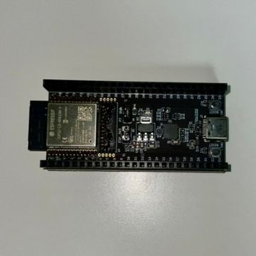
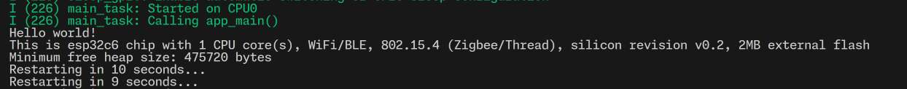

# 概要

- ESP32-C6をWSL2で開発して動かす。Hello, Worldまで。
- `usbipd-win` を入れるとWSL2上で `/dev/ttyUSB0` から通常のLinuxのようにデバイスを扱える。
- ビルドは `idf.py build` でできる。
- USB接続で `idf.py flash` でESP32-C6に書き込む（フラッシュする）
- `screen /dev/ttyUSB0 115200` で入出力を確認できる。

# はじめに

ESP32-C6と開発ボードESP-Module-Prog-1を購入した。



購入元はAliexpressの[Espressif公式ストア](https://ja.aliexpress.com/item/1005005870127463.html)。

ESP-Module-Prog-1のいいところは、スプリングピンでESP32シリーズをはめこめること。
したがって一般的な開発ボードとしてだけでなく、書き込み用のボードとしても使える。
ただし、JTAGが使えずUARTだけなのに注意（後述）。

この記事では、WSL2でESP32-C6を動かすまでを記録する。

## 環境
- Ubuntu 22.04 LTS on WSL2

# 1. 開発ボードのUSB-シリアル変換ICと通信を確認
ESP32-C6のプログラムを書く前に、まず開発ボードとUSBで通信できるか確かめる。

USBケーブルを接続し、Windowsのデバイスマネージャーを見ると、ESP-Module-Prog-1にはCP2102Nが搭載されているようだ。（目視でも確認できた。）

私のPCにはCP2102Nのドライバが入っていなかったので、[SILICON LABS公式](https://jp.silabs.com/interface/usb-bridges/usbxpress/device.cp2102n-gqfn20?tab=softwareandtools)から「CP210x ユニバーサル Windows ドライバ」をインストールした。

WSL上で通信する前に、WindowsでTeraTermなどでCP2102NのCOMポートを開くと動いていることが確認できた。（baudrateは115200。）

ちなみに大量の `invalid header: 0xffffffff` が流れていた。
参考：https://qiita.com/nichicon/items/43cc870701383fd14d53

## WSLからUSB-シリアル変換ICと通信
いくつかの記事では `usbipd-win` なしでシリアル通信している報告があったが、私の環境では動作しなかった。

参考記事
- [【Windows10/WSL Ubuntu】COMポートにアクセスしシリアル通信する | The modern stone age.](https://www.yokoweb.net/2018/03/05/windows10-wsl-com-port/)
- [WSLのコマンドラインからシリアル通信 - htkymtks](https://scrapbox.io/htkymtks/WSL%E3%81%AE%E3%82%B3%E3%83%9E%E3%83%B3%E3%83%89%E3%83%A9%E3%82%A4%E3%83%B3%E3%81%8B%E3%82%89%E3%82%B7%E3%83%AA%E3%82%A2%E3%83%AB%E9%80%9A%E4%BF%A1)
- [Windows 10 上の Ubuntu から COM ポートにアクセスする方法 | 穀風](https://kokufu.blogspot.com/2018/02/windows-10-ubuntu-com.html)

Windows上でCOMポート5のデバイスは、 WSL上で `/dev/ttyS5` に紐づけられるようで、これを `sudo screen /dev/ttyS5 115200` としてみたが動作しなかった。 

あきらめて `usbipd-win` を使うとWSL上からシリアル通信が可能になった。

1. `usbipd-win`をインストール。[公式リポジトリ](https://github.com/dorssel/usbipd-win)のReleaseから最新の `.msi` をダウンロードして実行する。
2. PowerShellを管理者権限で開き、まず `usbipd list` でCP2102Nの `BUSID` を確認する。
3. `usbipd bind --busid <your-busid>` を実行してバインドする。
    * 私の環境では `USBPcap` をインストールしていたせいで `--force` オプションが必要だった。
4. `usbipd attach --wsl --busid <your-busid>` を実行してWSLにアタッチする。
5. 上を実行した後、WSL上に `/dev/ttyUSB0` が作成されていた。`sudo screen /dev/ttyUSB0 115200` で無事通信できた。

# 2. VSCode+WSL+ESP-IDFの環境構築
[公式ドキュメント](https://docs.espressif.com/projects/esp-idf/en/latest/esp32/get-started/index.html)に従ってVSCode拡張のESP-IDFを入れるだけ。

1. [ドキュメント](https://docs.espressif.com/projects/esp-idf/en/latest/esp32/get-started/linux-macos-setup.html)に従い、WSL上で事前に必要なソフトウェアをインストールしておく。

```bash
sudo apt-get update
sudo apt-get install git wget flex bison gperf python3 python3-pip python3-venv cmake ninja-build ccache libffi-dev libssl-dev dfu-util libusb-1.0-0
```

2. ESP-IDFリポジトリをクローンする。

```bash
mkdir -p ~/esp
cd ~/esp
git clone --recursive https://github.com/espressif/esp-idf.git
```

3. ESP-IDFツールをインストールする。

```bash
cd ~/esp/esp-idf
./install.sh esp32,esp32c6
```

* `./install.sh` は引数でチップを指定してインストールできる。迷ったら `./install.sh all` で全部入れられる。

* 私はこのとき間違えてvenvの中で上記コマンドを実行してしまいエラーが出た。`which python3` が `/usr/bin/python3` を指す環境で実行するべき。

4. 環境変数を設定するスクリプトを実行する。

```bash
. ./export.sh
```

5. VSCodeで拡張機能ESP-IDFをインストールし、初期設定する。
    * 拡張機能のページにインストラクションが書いてあるので迷ったら読む。

以上で設定は完了。

# 3. hello_worldを動かしてみる。
上記手順が完了したら `~/esp/esp-idf/examples/get_started/hello_world` がダウンロードされているはず。
適当な場所にコピーしてVSCodeで開く。

**重要** "Select flash method..."ではUARTを選択する。ESP-Module-Prog-1ではJTAGは使えない。
[公式ドキュメント](https://espressif-docs.readthedocs-hosted.com/projects/esp-dev-kits/en/latest/other/esp-module-prog-1-r/user_guide.html)にJTAGを使えるとは書いてないし、[回路図](https://dl.espressif.com/dl/schematics/esp_idf/esp-module-prog-1-schematics.pdf)をよく見るとUSBのD+/D-がP10/P11とNC (Non Connected)ときちんと書かれていた。

ビルド・フラッシュ・モニターを実行すると以下の通り無事hello_worldを実行できた。



いったんここまで。

# 【参考】詰まった部分と読んだ資料メモ

- `screen`でシリアル通信を見ると`invalid header: 0xffffffff`がたくさん流れる現象。
    - UARTで正しくプログラムをフラッシュすれば解消した。
    - [ESP32でHSPIを使っていると初期化を繰り返すことがある問題 #VSCode - Qiita](https://qiita.com/nichicon/items/43cc870701383fd14d53)
    - [ESP32  ブート時のGPIO12によるFLASH電圧設定機能を無効化する - chakokuのブログ(rev4)](https://chakoku.hatenablog.com/entry/2020/01/25/234359)
- JTAGでフラッシュしようとすると、`openocd`の起動時に`Error: esp_usb_jtag: could not find or open device!`のエラーが出る。
    - そもそもESP-Module-Prog-1ではJTAGを使えなかった。ESP32-C6内蔵のUSB-JTAGコントローラーが`lsusb`で出ないんだから、デバイスをオープンできないのも当然だった。
    - [Error: esp_usb_jtag: could not find or open device! (OCD-668) · Issue #262 · espressif/openocd-esp32](https://github.com/espressif/openocd-esp32/issues/262)
    - [Troubleshooting FAQ · espressif/openocd-esp32 Wiki](https://github.com/espressif/openocd-esp32/wiki/Troubleshooting-FAQ) を参考に以下ページでeFuseについて確認した。
        - [espefuse.py - ESP32-C6 -  — esptool.py latest documentation](https://docs.espressif.com/projects/esptool/en/latest/esp32c6/espefuse/index.html)
    - ESP32-C6, ESP32-C6-WROOM-1, ESP-Module-Prog-1のデータシートを眺めてピン配列や回路図を見ているとようやく誤りに気付いた。
        - 開発ボードのドキュメント: [ESP-Module-Prog-1(R) — esp-dev-kits  documentation](https://espressif-docs.readthedocs-hosted.com/projects/esp-dev-kits/en/latest/other/esp-module-prog-1-r/user_guide.html)
        - モジュールのデータシート: [esp32-c6-wroom-1_wroom-1u_datasheet_en.pdf](https://www.espressif.com/sites/default/files/documentation/esp32-c6-wroom-1_wroom-1u_datasheet_en.pdf)
        - SoCのデータシート: [esp32-c6_datasheet_en.pdf](https://www.espressif.com/sites/default/files/documentation/esp32-c6_datasheet_en.pdf)
        - SoCのテクニカルリファレンス: [esp32-c6_technical_reference_manual_en.pdf](https://www.espressif.com/sites/default/files/documentation/esp32-c6_technical_reference_manual_en.pdf#usbserialjtag)
- WSLでJTAGを使えている方の記事が参考になった。
    - [Windows11 WSL2上のUbuntuでesp-idfを使う(2025/01/04更新) #M5stack - Qiita](https://qiita.com/tomorrow56/items/3252ff23846b0ed47132)